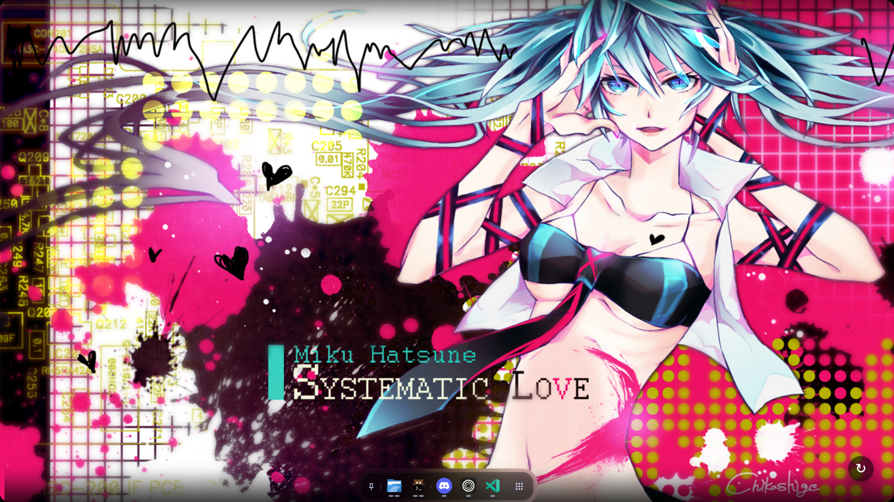

<p align="center">
  <h1 align="center">🌸 WaifuPaper 🌸</h1>
  
</p>

A modern, cross-platform live wallpaper application that displays random high-quality anime wallpapers from Konachan directly on your desktop.

## Preview



## Contents

-    [Features](#features)
-    [Installation &amp; Usage](#installation--usage)
     -    [Linux](#linux-wayland)
     -    [Windows](#windows)
-    [Development &amp; Building](#development--building)
-    [Acknowledgments](#acknowledgments)

## Features

-    **Cross-Platform:** Native support for Linux (Wayland/GTK4) and Windows (WinForms/WebView2).
-    **Interactive UI:** Smooth crossfade transitions and a modern "Random" button with backdrop blur.
-    **System Tray:** Minimal footprint with a system tray icon for easy exit.
-    **Lightweight:** Low resource usage, serving content via a local embedded proxy.

## Installation & Usage

### Linux (Wayland)

Requires `GTK4`, `WebKitGTK`, and `gtk4-layer-shell`. These dependencies must be installed via your system's package manager.

**Example (Arch Linux):**

```bash

sudo pacman -S gtk4 webkitgtk-6.0 gtk4-layer-shell libayatana-appindicator python-gobject

```

_Note: For other distributions, please find the equivalent packages (e.g., `libgtk-4-dev`, `libwebkit2gtk-4.1-dev` on Debian/Ubuntu)._

1. Download the latest `waifupaper_v*_linux.zip` from the [Releases](https://github.com/AzPepoze/waifupaper/releases/latest) page.
2. Extract the archive.
3. Run the launcher:
     ```bash
     ./waifupaper.sh
     ```

### Windows

1. Download the latest `waifupaper_v*_windows.zip` from the [Releases](https://github.com/AzPepoze/waifupaper/releases/latest) page.
2. Extract and run `WaifuPaper.exe`.

## Development & Building

### Prerequisites

-    **Node.js & pnpm:** For building the frontend.
-    **Python 3:** For running/packaging the Linux version.
-    **.NET 8 SDK:** For compiling the Windows version.

### Build Instructions

Run the automated build script to generate releases for both platforms:

```bash
python3 build.py
```

Outputs will be generated in the `release/` directory.

## Acknowledgments

-    Wallpapers provided by [Konachan](https://konachan.net).
